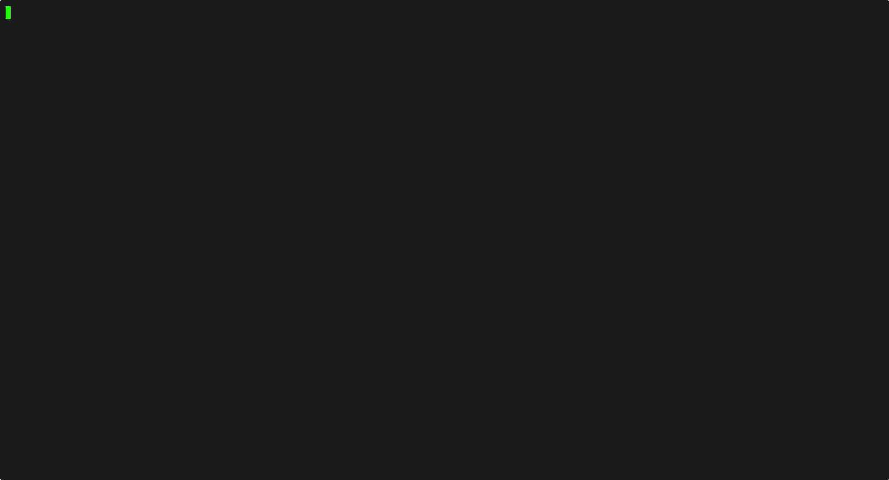
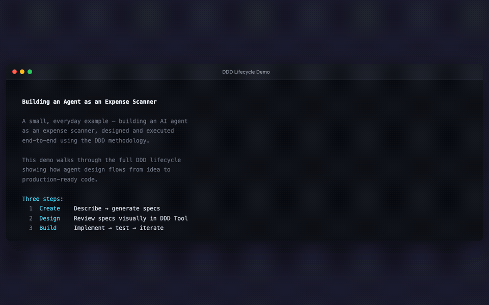
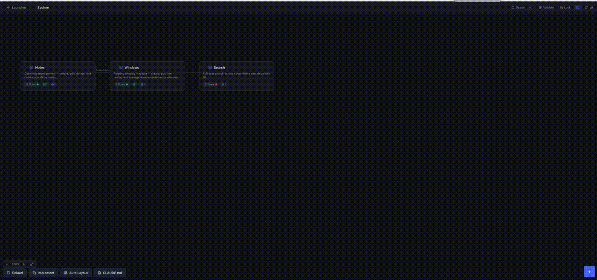

# Design Driven Development (DDD)

[]() [](LICENSE)

**Design software visually. Let AI implement it.**






Design Driven Development is a methodology for building software through visual flow diagrams that output YAML specs. Specs and code are both sources of truth at different levels — specs define what/why, code accumulates how. The Reflect phase feeds implementation wisdom back into specs.

> **Note:** The abbreviation "DDD" is used throughout this project for brevity. This is not related to Eric Evans' Domain-Driven Design, which is an entirely separate methodology. We use the full name "Design Driven Development" to avoid confusion.

## How It Works

```
 Phase 1: CREATE          Phase 2: DESIGN         Phase 3: BUILD          Phase 4: REFLECT

 Describe your software   Open DDD Tool           /ddd-scaffold           /ddd-sync
 /ddd-create generates    validate on canvas      set up skeleton         check alignment
 full YAML spec structure refine, adjust              │                       │
                                                      ▼                       ▼
                                                  /ddd-implement          /ddd-reflect
                                                  generate code + tests   capture wisdom
                                                      │                       │
                                                      ▼                       ▼
                                                  /ddd-test               /ddd-promote
                                                  verify tests pass       enrich specs
```

**Create** → describe your project, `/ddd-create` generates full YAML specs. **Design** → review in the [Design Driven Development Tool](https://github.com/cybersoloss/ddd-tool) desktop app. **Build** → `/ddd-scaffold` + `/ddd-implement` + `/ddd-test`. **Reflect** → `/ddd-sync` + `/ddd-reflect` + `/ddd-promote` to feed code wisdom back into specs.

The **specs directory** is the contract between phases. The human bridges them — reviewing design decisions that AI can't make alone.

> Legacy docs may reference "Session A" (= Phase 1+2) and "Session B" (= Phase 3+4).

## Commands

Eleven Claude Code slash commands power the Design Driven Development workflow:

| Phase | Command | What it does |
|-------|---------|-------------|
| Create | `/ddd-create` | Describe a project in natural language → full DDD spec structure. Use `--shortfalls` for gap analysis. |
| Create | `/ddd-reverse` | Reverse-engineer existing code → DDD specs (6 strategies by codebase size) |
| Any | `/ddd-update` | Natural language change request → updated YAML specs |
| Build | `/ddd-scaffold` | Set up project skeleton from specs (Phase 3 first step) |
| Build | `/ddd-implement` | Read specs → generate flow code + tests, update mapping |
| Build | `/ddd-test` | Run tests for implemented flows without re-generating code |
| Reflect | `/ddd-sync` | Sync mapping, discover untracked code, fix drifted implementations |
| Reflect | `/ddd-reflect` | Capture implementation wisdom as annotations in `.ddd/annotations/` |
| Reflect | `/ddd-promote` | Move approved annotations into permanent specs |
| Any | `/ddd-status` | Quick read-only overview of project implementation state |
| Meta | `/ddd-evolve` | Analyze shortfall reports → `--review` for decisions → `--apply` to execute |

### Ongoing Development

```bash
# Change a flow, then re-implement
/ddd-update users/user-login "Add rate limiting"
/ddd-implement users/user-login

# Scope: --all (project), domain, domain/flow
/ddd-implement --all
```

### Evolving the Framework

```bash
# Track framework limitations while designing
/ddd-create My SaaS app with real-time collab. TypeScript, Hono. --shortfalls
# → generates specs + specs/shortfalls.yaml with gap analysis

# Accumulate shortfalls across projects, then analyze
/ddd-evolve --dir ~/code/projA --dir ~/code/projB

# Review each finding interactively (approve/defer/reject)
/ddd-evolve --review ddd-evolution-plan.yaml

# Apply approved changes to the DDD framework
/ddd-evolve --apply ddd-evolution-plan.yaml
```

See the [Usage Guide — Shortfalls & Evolve](DDD-USAGE-GUIDE.md#shortfalls--evolve-end-to-end-example) for a full walkthrough with example output.

### Install Commands

```bash
git clone https://github.com/cybersoloss/claude-commands.git
cd claude-commands && ./install.sh
```

Or manually:

```bash
git clone https://github.com/cybersoloss/claude-commands.git
mkdir -p ~/.claude/commands
cp claude-commands/ddd-*.md claude-commands/DDD-commands.md ~/.claude/commands/
```

Restart Claude Code to load the commands. Won't overwrite existing commands.

## Try It in 5 Minutes

**Prerequisites:** [Claude Code](https://docs.anthropic.com/en/docs/claude-code) installed, plus the [DDD commands](#install-commands).

The [examples/todo-app/](examples/todo-app/) directory contains a complete spec set for a simple todo app (2 domains, 4 flows). Open it to see what DDD specs look like, or use it as a starting point:

```bash
cd examples/todo-app
/ddd-scaffold
/ddd-implement --all
/ddd-test --all
```

## Four Pillars

Every DDD project generates specs across all four foundational pillars of software:

| Pillar | Spec Files | What it covers |
|--------|-----------|---------------|
| **Logic** | `domains/*/flows/*.yaml` | Backend flows — API endpoints, cron jobs, event handlers, agent pipelines |
| **Data** | `schemas/*.yaml`, `shared/types.yaml` | Models, fields, indexes, relationships, transitions, seed data |
| **Interface** | `ui/pages.yaml`, `ui/*.yaml` | Pages, navigation, components, forms, data bindings, visual states |
| **Infrastructure** | `infrastructure.yaml` | Services, ports, startup order, deployment strategy |

`/ddd-create` generates all four. `/ddd-implement` builds from all four. No pillar gets silently skipped.

## Repository Structure

```
DDD/
├── DDD-USAGE-GUIDE.md              # How to write DDD specs (fetched by commands at runtime)
├── examples/
│   └── todo-app/                   # Complete example project (try it in 5 minutes)
├── templates/
│   ├── architecture-template.yaml   # Project structure & conventions
│   ├── config-template.yaml         # Environment variables schema
│   ├── errors-template.yaml         # Standardized error codes
│   ├── schema-template.yaml         # Data models: fields, indexes, transitions, seed
│   ├── ui-page-template.yaml        # UI pages: sections, forms, data bindings
│   └── infrastructure-template.yaml # Services, ports, deployment
└── tests/
    └── e2e/                         # End-to-end test infrastructure
        ├── generate-tests.md        # Generator prompt (regenerates test artifacts)
        ├── product-features.md      # Generated: product exercising every DDD feature
        └── ddd-tool-auto-test-prompt.md  # Generated: auto-test runner for ddd-tool
```

> **Commands** live in the [claude-commands](https://github.com/cybersoloss/claude-commands) repo.

## Key Documents

### [DDD Usage Guide](DDD-USAGE-GUIDE.md)
The definitive reference for writing Design Driven Development specs. Covers all 29 node types, YAML formats, connection patterns, supplementary spec files, validation rules, design patterns, and complete examples. This is what `/ddd-create` fetches at runtime to generate correct specs.

### [Examples](examples/)
Complete spec sets you can open in the DDD Tool or feed to `/ddd-implement`.

### [Templates](templates/)
Reusable YAML templates for all spec types — architecture, config, errors, schemas, UI pages, and infrastructure. These are included automatically when you run `/ddd-create` — the templates are here for reference.

### [End-to-End Tests](tests/e2e/)
A self-regenerating test infrastructure that verifies the DDD ecosystem (guide + commands + tool) works together. A [generator prompt](tests/e2e/generate-tests.md) reads the current state of all three repos and produces a product description exercising every DDD feature, plus an auto-test runner prompt for the ddd-tool. Regenerate monthly or after any framework change — the tests evolve with DDD.

## Related Repos

| Repo | What it is | Who it's for |
|------|-----------|-------------|
| [ddd-tool](https://github.com/cybersoloss/ddd-tool) | Desktop app — visual flow editor | Users designing specs on canvas |
| [claude-commands](https://github.com/cybersoloss/claude-commands) | Claude Code slash commands | Users running DDD commands in the terminal |


